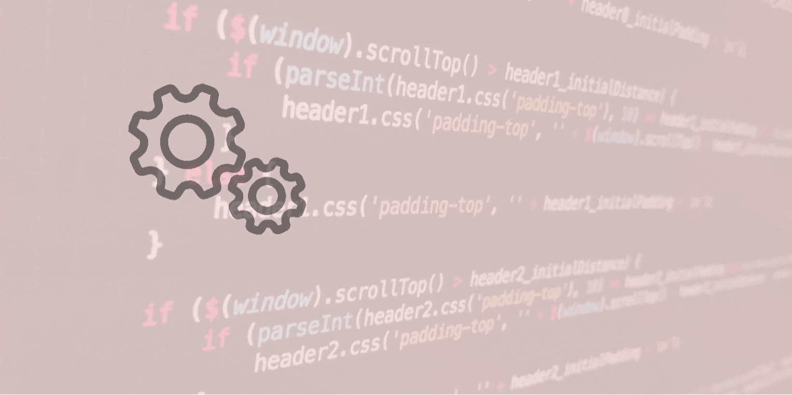

# Web Developer Study
## 12 months web developer study. I decided to dedicate at least 12 months to learn web development.

* Online courses, challenges and creation of my own projects.

## Project + Result
* (HTML/CSS 1) - HTML Crash Course For Absolute Beginners [link](https://github.com/pittyh6/12Mths-WebDevelopmentStudy-2022-2023/tree/master/WDS-18_HTML-CSS_1_HTML_Crash_Course_For_Absolute_Beginners)

* (HTML/CSS 2) - CSS Crash Course For Absolute Beginners [link](https://github.com/pittyh6/12Mths-WebDevelopmentStudy-2022-2023/tree/master/WDS-24_HTML-CSS-2_CSS_Crash_Course_For_Absolute_Beginners)

## Management Tools
* Jira(Sprints) [link](https://github.com/pittyh6/12Mths-WebDevelopmentStudy-2022-2023/tree/master/Sprint)

### Result
* Desktop

## Tools

## What I learned/used (overall)
* HTML 5
* Semantic tags
* tags
* CSS
* properties
* values
* selectors

### You can find it in detail in the links below or inside each project folder in the readMe file what was learned and done.
* HTML [link](https://github.com/pittyh6/12Mths-WebDevelopmentStudy-2022-2023/blob/master/learnedHTML.md)
* CSS [link](https://github.com/pittyh6/12Mths-WebDevelopmentStudy-2022-2023/blob/master/learnedCSS.md)

